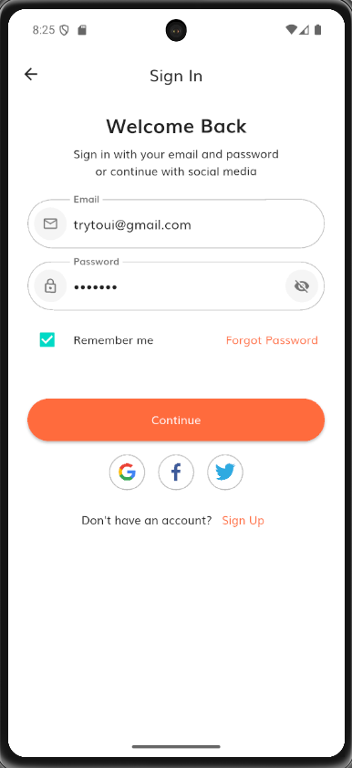

# Flutter Auth UI Demo

A simple **Flutter authentication UI demo** with:
- Custom `AuthScaffold` for a clean layout  
- Form validation (email & password)  
- Social login buttons (Google, Facebook, Twitter)  
- Reusable UI components (text fields, primary button)  
- Light theme with custom tokens and typography  

(screenshot2.png)

---

## 🚀 Features
- ✅ Clean architecture & reusable widgets
- ✅ Email & password validation
- ✅ Toggle password visibility
- ✅ "Remember me" checkbox
- ✅ Social login buttons
- ✅ Fully responsive layout

---

## 🛠️ Project Structure

```
lib/
├── core/
│   └── theme/
│       ├── app_theme.dart
│       ├── tokens.dart
│       └── typography.dart
├── features/
│   └── auth/
│       └── sign_in_page.dart
├── widgets/
│   ├── app_text_field.dart
│   ├── auth_scaffold.dart
│   ├── primary_button.dart
│   └── social_row.dart
└── main.dart
```

---

## 🧪 How to Run

1. **Clone the repo**
```bash
git clone https://github.com/mehmetalihawk/flutter_auth_ui_demo.git
cd flutter_auth_ui_demo
```

2. **Install dependencies**
```bash
flutter pub get
```

3. **Run the app**
```bash
flutter run
```

---

## 📦 Assets

- Fonts: `Muli`
- Icons: `Google`, `Facebook`, `Twitter` (SVG)
- Theme tokens are defined in `tokens.dart`.

---

## 📝 Notes
- Update `pubspec.yaml` if you add more assets.
- You can replace social icons with your own SVGs.
- Form validation rules are in `sign_in_page.dart`.

---

## 📄 License
This project is open source and available under the [MIT License](LICENSE).
